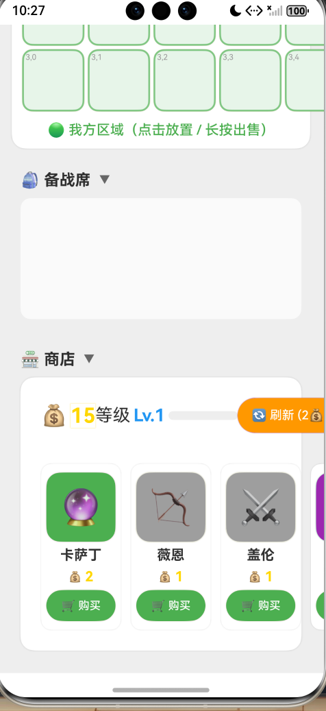
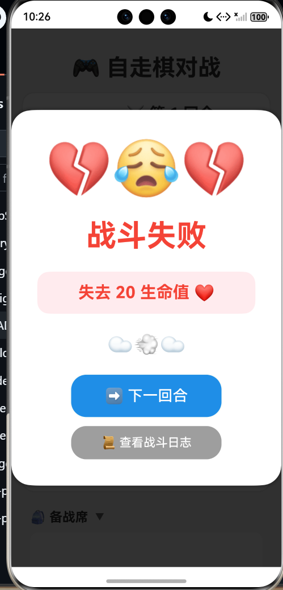

# HMZQ 单机自走棋

一款纯本地运行、无需联网的单机自走棋游戏项目

---

## 🎮 项目介绍

HMZQ 单机自走棋是一款完全离线运行的策略战棋游戏，所有对局逻辑、棋子数据、羁绊效果、装备系统均在本地完成计算，无需网络连接即可畅玩。游戏采用经典的自走棋玩法，玩家通过招募棋子、搭配羁绊、合成装备，在棋盘上与 AI 对手展开策略对决。

### 核心特色

- **完全离线**：无需服务器、无需登录、无需网络请求，随时随地开玩
- **自定义羁绊系统**：支持玩家自定义棋子羁绊组合，创造独一无二的战术流派
- **随机野怪回合**：每局游戏中野怪回合的掉落装备和金币随机生成，增加重玩价值
- **装备合成系统**：基础装备可两两合成高级装备，为棋子提供强力属性加成
- **段位人机对手**：AI 对手根据玩家段位动态调整难度，从青铜到王者逐级挑战

---

## 图片




## 📦 安装与运行

### 环境要求

- Python 3.8+
- Pygame 2.0+

### 安装步骤

```bash
# 克隆仓库
git clone https://github.com/yourname/HMZQ-auto-chess.git
cd HMZQ-auto-chess

# 安装依赖
pip install -r requirements.txt

# 启动游戏
python main.py
```

### 运行模式

| 模式 | 说明 |
|------|------|
| 经典模式 | 标准 8 人混战，最后存活者获胜 |
| 挑战模式 | 连续挑战更高段位的 AI 对手 |
| 自定义模式 | 自由调整羁绊规则、装备掉落率等参数 |

---

## 🎯 游戏玩法

### 基础操作

1. **招募棋子**：消耗金币从棋子池招募英雄，拖拽至棋盘上阵
2. **升级人口**：消耗金币提升人口上限，可上阵更多棋子
3. **刷新商店**：消耗 2 金币刷新商店棋子列表
4. **合成升星**：收集 3 个相同棋子合成更高星级，提升属性与技能效果

### 战斗流程

- **准备阶段**：30 秒时间调整阵容、装备分配
- **战斗阶段**：自动战斗，棋子根据 AI 逻辑自动释放技能
- **结算阶段**：根据胜负获得金币、经验与血量变化

### 经济系统

| 收入来源 | 说明 |
|----------|------|
| 基础收入 | 每回合固定获得 5 金币 |
| 利息收入 | 每存 10 金币额外获得 1 金币利息（上限 5 金币） |
| 连胜/连败 | 连续胜利或失败获得额外金币奖励 |
| 野怪掉落 | 击败野怪随机掉落金币或装备 |

---

## ⚔️ 棋子与羁绊

### 棋子分类

棋子按稀有度分为 1~5 费，费用越高基础属性越强，技能效果越强力。

| 费用 | 出现概率（1 级） | 出现概率（9 级） |
|------|------------------|------------------|
| 1 费 | 100% | 13% |
| 2 费 | 0% | 20% |
| 3 费 | 0% | 25% |
| 4 费 | 0% | 30% |
| 5 费 | 0% | 12% |

### 羁绊系统

游戏内置多种经典羁绊，玩家也可通过配置文件自定义新增羁绊：

| 羁绊名称 | 触发条件 | 效果描述 |
|----------|----------|----------|
| 战士 | 3/6/9 | 增加护甲与生命值 |
| 法师 | 3/6 | 增加法术强度，技能伤害提升 |
| 刺客 | 2/4/6 | 增加暴击率与暴击伤害 |
| 射手 | 2/4 | 增加攻击速度 |
| 骑士 | 2/4/6 | 获得伤害减免护盾 |
| 德鲁伊 | 2/4 | 棋子升星所需数量减少 |

---

## 🛡️ 装备系统

### 基础装备

游戏共有 9 种基础装备，击败野怪或选秀环节获取：

- **暴风大剑**：+15 攻击力
- **反曲之弓**：+15% 攻击速度
- **无用大棒**：+15 法术强度
- **女神之泪**：+15 法力值
- **巨人腰带**：+150 生命值
- **锁子甲**：+20 护甲
- **负极斗篷**：+20 魔抗
- **金铲铲**：用于合成转职装备
- **拳套**：+10% 暴击率，+10% 闪避率

### 装备合成

任意两件基础装备可合成一件高级装备，共 45 种合成组合：

| 合成公式 | 高级装备 | 效果 |
|----------|----------|------|
| 大剑 + 大剑 | 无尽之刃 | +40 攻击力，+25% 暴击率 |
| 大剑 + 大棒 | 科技枪 | +15 攻击力，+15 法强，造成伤害的 33% 转化为治疗 |
| 大棒 + 大棒 | 灭世者的死亡之帽 | +75 法术强度 |
| 弓 + 弓 | 疾射火炮 | +30% 攻速，攻击距离翻倍 |
| 腰带 + 锁子甲 | 红 BUFF | +150 生命值，+20 护甲，普攻附带灼烧 |
| 金铲铲 + 大剑 | 战士转职 | 使携带者获得战士羁绊 |

---

## 🤖 AI 对手系统

### 段位分级

AI 对手根据玩家当前段位匹配不同难度：

| 段位 | AI 特点 |
|------|---------|
| 青铜 | 随机招募，无羁绊意识 |
| 白银 | 基础羁绊搭配，经济管理较差 |
| 黄金 | 主流阵容成型，会卡利息 |
| 铂金 | 灵活变阵，会针对玩家阵容 |
| 钻石 | 高级运营，精准计算伤害 |
| 大师 | 极限经济利用，完美站位 |
| 王者 | 全知全能，近乎零失误 |

### AI 行为逻辑

1. **阵容评估**：AI 实时评估场上阵容强度，决定是继续追三星还是提升人口
2. **装备分配**：根据棋子定位自动分配最优装备
3. **站位调整**：针对敌方刺客/法师等阵容动态调整站位
4. **经济运营**：根据血量与局势决定是存钱吃利息还是 D 牌提质量

---

## 🤝 贡献指南

欢迎提交 Issue 和 Pull Request！

1. Fork 本仓库
2. 创建特性分支：`git checkout -b feature/AmazingFeature`
3. 提交更改：`git commit -m 'Add some AmazingFeature'`
4. 推送分支：`git push origin feature/AmazingFeature`
5. 提交 Pull Request

---

## 📄 开源协议

本项目基于 MIT 协议开源，详见 [LICENSE](LICENSE) 文件。

---

## 🙏 致谢

- 灵感来源于《刀塔自走棋》《云顶之弈》等经典自走棋游戏
- 感谢所有贡献者与测试玩家的支持

---

> **提示**：本项目为个人学习作品，仅供学习交流使用，请勿用于商业用途。
